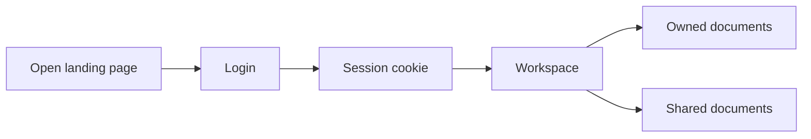
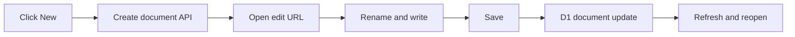
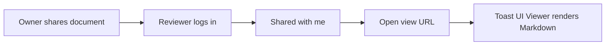
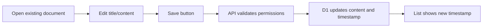
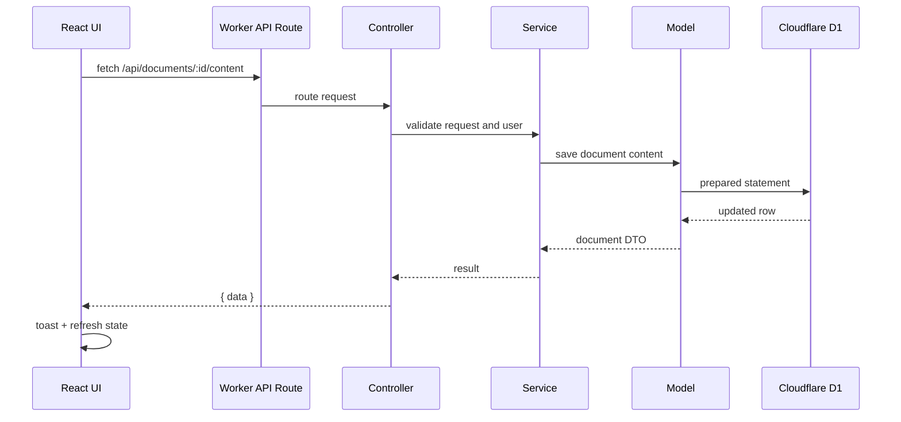

# Doc-Me-In Architecture

Doc-Me-In is an Astro 6 app with React islands for authentication and document editing. Astro serves pages and static assets through a Cloudflare Worker. The Worker routes `/api/*` requests through thin controllers, service modules, model modules, and Cloudflare D1.

## Overview

- UI: Astro pages, React 19 app shell, Toast UI editor/viewer, Tailwind v4, lucide icons.
- API: `src/api/routes/router.ts` dispatches to controllers, services, and model functions.
- Storage: D1 stores users, credentials, documents, shares, imports, and attachment metadata.
- R2: `sample-doc-editor-storage` stores original uploaded files. D1 stores editable Markdown/HTML/text and R2 object pointers.
- Auth: Seeded credential login plus registration. Password hashes use Web Crypto PBKDF2, not bcrypt.

## Data Model

- `users`: account identity and display info.
- `auth_credentials`: email, salt, PBKDF2 hash.
- `documents`: owner, title, Markdown, HTML, text, timestamps.
- `document_shares`: shared user, document, role.
- `document_imports`: import status, file name, file type, size.
- `document_attachments`: original upload metadata and R2 key.

## Priorities

- Make reviewer journey fast: login, create/import, edit, save, share, view, delete.
- Keep each page URL meaningful: landing, login, register, app list, view, edit.
- Store editable content in D1; store binaries/original uploads in R2.
- Prefer manual save and clear state over hidden autosave complexity.

## Tradeoffs

- No real-time co-editing yet. Sharing is permission-based, not live cursor collaboration.
- Legacy `.doc` is unsupported. `.docx` converts client-side to Markdown with Mammoth before upload.
- Seed credentials exist for reviewer speed; registration is available for new users.
- Version history and autosave remain stretch work.

## Onboarding Journey

## Creation Journey

## Viewing Journey

## Update Journey

## API To UI Flow

